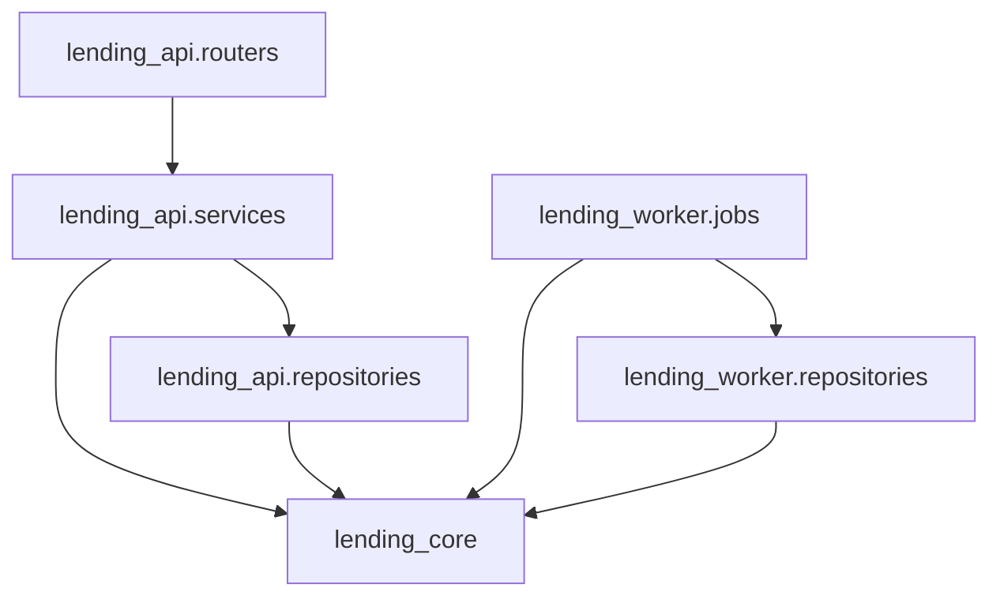

# アーキテクチャ

## レイヤ構造

## 依存ルール

1. **`lending_core` は他のどのパッケージにも依存しない。** 標準ライブラリ / SQLAlchemy / Pydantic のみ。
2. **`lending_api` と `lending_worker` は互いに依存しない。** 共通化が必要なものは `lending_core` に置く。
3. **ルータは DB セッションを直接触らない。** 必ず service を経由する。
4. **service は SQLAlchemy のクエリを直接書かない。** 必ず repository を経由する。
5. **業務ルール（期限計算・延滞判定・違約金算出）は `lending_core.rules` / `lending_core.money` に集約する。** service 側にロジックを複製しない。

## 各レイヤの責務

### routers

HTTP の入出力のみを担当。認可チェック（`require_role`）とスキーマ変換を行い、業務処理は service に委譲する。

### services

ユースケース単位の処理を組み立てる。トランザクション境界はここ。ドメインルールは `lending_core.rules` を呼び出す。

### repositories

SQLAlchemy による永続化。1 メソッド = 1 クエリを原則とし、ループ内でのクエリ発行（N+1）を避ける。関連エンティティが必要な場合は `selectinload` / `joinedload` で明示的に eager load する。

### lending_core

フレームワークに依存しない純粋なドメインロジック。副作用（DB アクセス・HTTP・ログ出力）を持たない。

## 時刻の扱い

現在時刻の取得は **必ず `lending_core.clock.now()` を使う**。`datetime.now()` / `datetime.utcnow()` の直接呼び出しは禁止（テスト時に固定できないため、および naive datetime の混入を防ぐため）。すべての datetime は tz-aware な UTC で扱い、表示層でのみローカルタイムに変換する。

## キャッシュ

`lending_worker.cache` は日次集計結果のキャッシュを保持する。**集計対象のデータ（Loan / Item）を更新する処理は、必ず対応するキャッシュキーを無効化する。**
